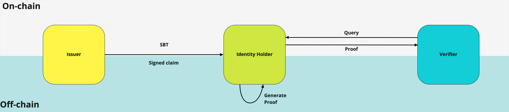

# Zero-Knowledge Soul-Bound-Token (ZK SBT)

One of the major concerns with SBTs presented in the Decentralized Society [paper](https://vitalik.ca/general/2022/01/26/soulbound.html) (Glen Wely, Puja Ohlhaver, and Vitalik Buterin) and [article](https://papers.ssrn.com/sol3/papers.cfm?abstract_id=4105763) (Vitalik Buterin) has been the assumption that SBTs contain public data on-chain. This assumption has stirred a lot of debate in the Web3 community with what technical substrate to be leveraging in order to represent the key outcomes from the Decentralized Society paper (Verifiable Credentials or assumed technical specs of an SBT).  

As Vitalik Buterin has mentioned [publicly](https://twitter.com/VitalikButerin/status/1530265766032838656?s=20&t=hNyxz5KEaL1cW5crxj01Rw) "I think the optimal technical solution [to represent identity related information] includes both on-chain and off-chain data and ZKPs over both". Not only Vitalik, but many thought leaders in the VC and Web3 native communities have agreed that the solution is not binary, but a pluralistic one. 

The key design considerations we took included: portability; provisioned privacy; efficient storage; and composability with Web3 developers. 

In this repository, we provide the tools needed to ensure that: 

- Identity holders are able to protect the contents of their data with the same privacy guarantees of verifiable credentials
- Identity holders are able to participate in the on-chain composable logic that the Web3 infrastructure is built on.
- Identity holders can provision access to data and control over data storage.

In this library developers are provided with the tooling to issue zero-knowledge proof soul bound tokens (ZK SBTs) and verify them on-chain. This library leverages [Iden3 go-libraries](https://github.com/iden3/go-iden3-core) and [Iden3 circuits](https://github.com/iden3/circuits).

ZK SBTs allows for the creation of a composable network of trust. The token is always visible on chain making impossible for a user to hide the existance of an information when requested. The information contained in the claim is obscured using ZK in order to guarantee privacy. The only thing stored on chain is the hash of a signed message.

The proof of concept introduced here is based on this approach. 

Core Team: [Enrico Bottazzi](https://twitter.com/backaes) + [Shrey Jain](https://twitter.com/shreyjaineth).

The repository is not production ready and should be used only for testnet experiments.

# Core Components

### Claim

The core data structure used to represent identity related information is [Iden3's Claim](https://docs.iden3.io/protocol/claims-structure/)

- The information stored in the claim is in a plain text format
- Claims are issued by an issuer to attest to information
- When issued, the issuer signs the claim and passes the signature to the receiver of the claim
- Claims and claims' signatures live off-chain

This example considers an elementary claims that attests someone's age: `ageClaim`

```
Index:
{
    "106590880073303418818490710639556704462", // Schema + header
    "0",
    "25", // first index data slot <- age
    "0"  // second index data slot
}

Value:
{ 
    "0",
    "0",
    "328613907243889777235018884535160632327", // first value data slot <- rand value to avoid rainbow attacks
    "0"  // second value data slot
}   
```

### SoulBound Token

The data structure used to represent a claim on-chain is a non-transferable ERC721 [`PrivateSoulMinter`](./contracts/PrivateSoulMinter.sol)

- The ZK SBT contains a hash of the signed claim. This is the only information related to the claim stored on-chain.
- The ZK SBT is minted by the issuer smart contract to the claim receiver 

### ZKP Generation and Verification

Smart contracts can make query to someone's claim and verify the query inside a Smart Contract. The query can be "you must be over 18 to interact with my contract". 

In this example, the smart contract that gives access to an airdrop only to people that prove being over 18 [`PrivateOver18Airdrop`](./contracts/PrivateOver18Aidrop.sol).

The query, on an elementary level, looks like this: 

```
    SlotIndex: 2,  // Position inside the claim of the queried value
    Values:    18, // Threshold value
    Operator:  3,  // 3 means "greater than"
```

The ZK SBT owner starting from the signed claim and the verifier's query can generate a proof that includes:

- The information contained inside a claim satisfies verifier's query
- The claim was signed by issuer's key

The proof is generated using the [`verify-claim`](./circuits/lib/verify-claim.circom) circuit.

The proof is then verified inside the smart contract against the hashed signed inside the ZK SBT. The verifier smart contract does not have access to the information stored inside the claim. The verifier smart contract can apply further on-chain logic after the proof is verified.



### Scripts

The circuits have been pre-compiled using the `powersOfTau28_hez_final_15.ptau`trusted set-up.

- Issue, sign the claim, define the query in order to generate the input for the circuit. 

    ```bash
    go run scripts/signClaim.go
    ```
    copy and paste the result inside a new file called `input.json` inside `build/verify/verify_js`

- Deploy the smart contracts

    ```
    npx hardhat run scripts/deploy.js --network mumbai
    ```
 - You will get an output like this:
     - `Soul Minter address:` 0xabcd......
     - `Verifier contract address:` 0x1234....
     - `PrivateOver18Airdrop contract address:` 0xfoobar....

      Navigate inside [`mint.js`](scripts/mint.js) paste your output of `Soul Minter address` and also `sigR8x`, `sigR8y`, `sigS` which can be found on [`input.json`](build/verify/verify_js/input.json)
    
-  Mint an SBT that includes a hash of the signature of the claim to the claim's receiver

    ```bash
    npx hardhat run scripts/mint.js --network mumbai
    ```

-  Generate the ZKP proof in solidity calldata format

    ```bash 
    bash scripts/generate.sh verify
    ````

      The output you get from this command represent the solidity calldata needed to verify the proof
   
- Zk-SNARK proof and public inputs you’ve generated should be structured as follows:
    - `a:` This is the initial element of your array, which itself is an array comprising two strings.
    - `b:` This is the second element of your array, which is an array of two sub-arrays, each containing two strings.
    - `c:` This is the third element of your array, which is another array of two strings.
    - `input:` This is the fourth element of your array, which is a lengthy array of strings.

  Please replace your [`verify.js`](scripts/verify.js) with output array and the `PrivateOver18Airdrop` contract address along with `tokenID`. 

- Verify the proof on-chain

    ```bash
    npx hardhat run scripts/verify.js --network mumbai
    ```

### Test

- To Test the contract and the circuit

    ```bash
    npx hardhat test
    ```

### Front-end

Check out the Frontend Repo [Github - ZK-SBT-FrontEnd](https://github.com/enricobottazzi/ZK-SBT-FrontEnd)


### Other Design choices

- This library uses babyjubjub signature schema. This schema is more zkp friendly and require far less computation to verify signature inside a circuit. Theoretically, ECDSA schema are already usable inside circuit [0xParc - circom-ecdsa](https://github.com/0xPARC/circom-ecdsa) but the proof generation currently requires a device with 56GB RAM.
- [Iden3's claim data structure](https://iden3.github.io/docs-temp-public-tutorials/) is much more expandable and can include more complex data information (up to 4 data slots) and features such as expiration, revocation or self attestation
