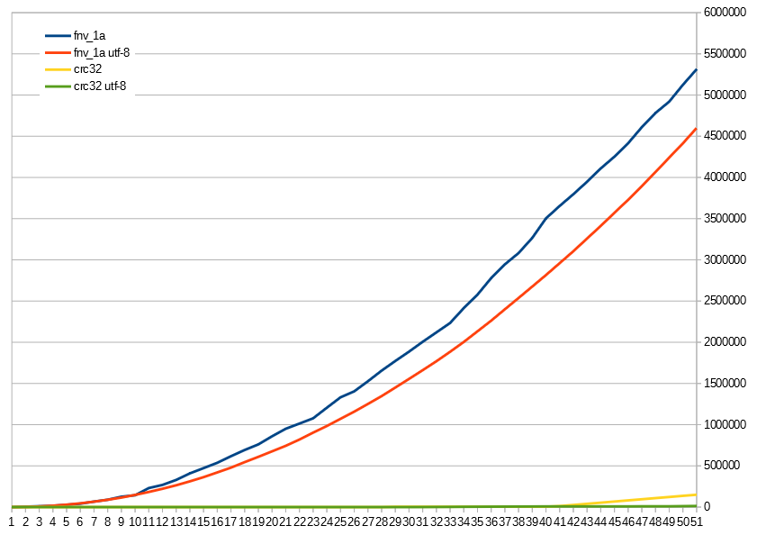

Benchmarks
==========

`fnv-plus` was benchmarked against several node modules which also calculate
FNV hashes. It was laso compared with previous version to see difference
between optimized and `jsbn` based implementations. For full report see
[bench.txt](bench.txt). You can also run benchmark by `node bench.js`.

At the moment fnv-plus is fastest for 32bits

    Benchmarking: fnv_1a 32bit hashes as INT (in ops/sec)
        crc32         :  7,585,538
        node-hashes   :  1,973,088
        fnv           :    553,800
        fnv32         :  1,754,290
        dding-fnv     :  4,289,330
        fnv1a         :  3,312,211
        fnv+ old      :  2,187,938
        fnv+ new      :  6,868,300
        fnv+ fast     : 10,416,654
    ---------------------------------
    Fastest is "fnv+ fast".

Note: `node-hashes` is native module written in C.

And for 64bit (but `dding-fnv` is the one other module supporting 64bit though...)

    Benchmarking: fnv_1a 64bit hashes (in ops/sec)
        dding-fnv     :        199
        fnv+ old      :     24,842
        fnv+ new      :  4,072,485
        fnv+ fast     :  5,461,176
        fnv+ old 52   :     11,691
        fnv+ new 52   :  5,521,316
        fnv+ fast 52  :  8,311,094
    ---------------------------------
    Fastest is "fnv+ fast 52".

Here you can see also 52bit functions. ~~And for some reason they are even
faster thatn 32bit! I can't explain this. Looks like some fancy v8
optimizations.~~ (now i know what math get slower when you get more than 32 bits)

Other bitsizes was only in `fnv-plus` and now they runs 100 times faster.

## Lib-overhead

Nice API, useful options, checks for valid input - all this add to run costs.
Here you can see how it affects 52bit variant of hash.

    Benchmarking: fnv+ 1a 52bit hash (in ops/sec)
        hex convert   :  1,243,310      value: "9d30437a43ec0"
        str convert   :  1,550,846      value: "r87omfbw74"
        dec value     :  4,017,340      value: "2765289857236672"
        value.toString:  4,811,368      value: "2765289857236672"
        direct value  :  5,660,775      value: 2765289857236672
        fnv+ fast hex :  5,591,846      value: "9d30437a43ec0"
        fnv+ fast     :  8,266,190      value: 2765289857236672
    ---------------------------------
    Fastest is "fnv+ fast".

Fast function does not convert hash to hex or dec strings, has hardcoded seed
and provides only 1a variant of the algorithm. It also returns calculated
value directly. All this makes it 6 times faster than hex variant of the
function.

But from other hand all this is valid for case when you hash short string.
Here even native implementations are slower than pure JS. Because there is
aditional overhead for calling native function.

But if you want to hash really big strings, then *lib-overhead* does not
matter much. And native modules are fastest one.

    Benchmarking: fnv_1a 32bit hashes as INT (in ops/sec)
        crc32         :        205
        node-hashes   :        329
        fnv           :         66.88
        fnv32         :        110
        dding-fnv     :        130
        fnv1a         :        123
        fnv+ old      :         79.37
        fnv+ new      :        248
        fnv+ fast     :        240
    ---------------------------------
    Fastest is "node-hashes".

## UTF-8 and binary strings

Currently `fnv-plus` implemented for binary strings. For handling UTF-8
strings implementation must be extended with checks for `charCode` value. This
will be additional overhead. But is this really important?

I did collizions test wiht 32, 52 and 64 bit versions of FNV. Test was
performed for 200,000,000 unique short strings. Full report see in
[utfbench.txt](utfbench.txt). You can also run benchmark by
`node utfbench.js`.

#### Results:

 - binary 32bit fnv_1a had 5,312,923 collisions (2.656%)
 - UTF-8 32bit fnv_1a had 4,599,880 collisions (2.3%)

I think what having 0.356% less collisions by sacrificing execution speed does
not worth it. This hash function is not secure and does not guerantee good
collisions resistance, so when we use it we already expect a lot of
collisions, so why bother?

But it was interesting to see how amount of collisions grow over time for this
two functions:

And look at CRC32:

 - binary CRC32 had 149,537 collisions (0.075%)
 - UTF-8 CRC32 had 13,319 collisions (0.007%)

For 52 and 64 bit variants results are:

 - binary 52bit fnv_1a had 12 collisions
 - UTF-8 52bit fnv_1a had 6 collisions
 - binary 64bit fnv_1a had no collisions
 - UTF-8 64bit fnv_1a had 4 collisions

200,000,000 samples are not enough here. So we can't tell how this will grow further. But results for 64bit version is quite interesting (or maybe all this is just false positives from Bloom filter?).
